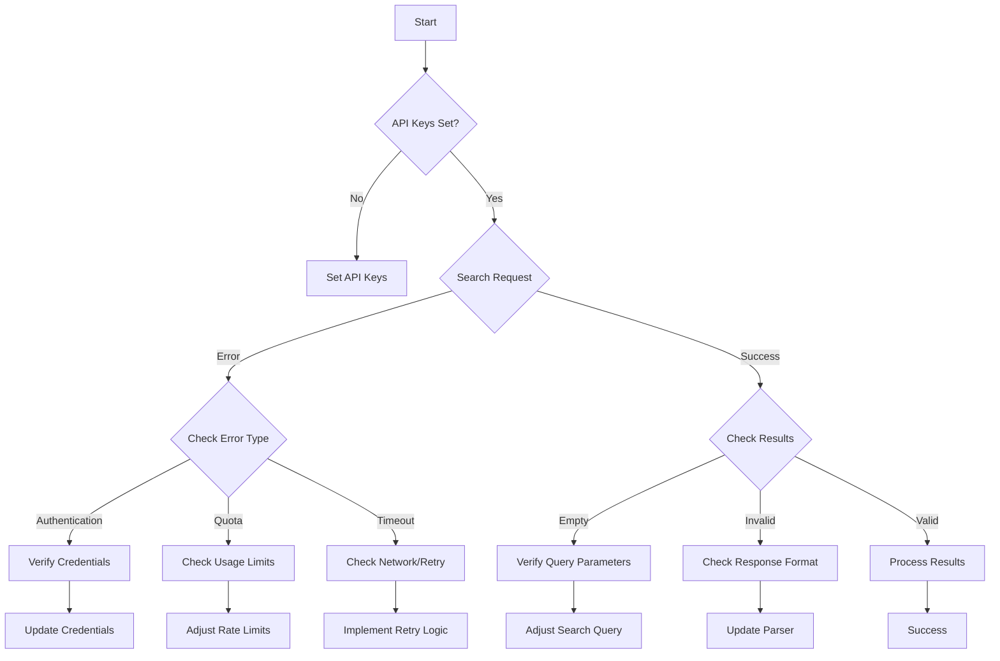

# MCP Google Search Troubleshooting Flowchart

## Using This Flowchart

1. **Start**: Begin at the top with basic configuration
2. **API Verification**: Ensure all credentials are set
3. **Request Flow**: Follow the search request process
4. **Error Handling**: Navigate different error scenarios
5. **Success Path**: Process valid results

## Common Decision Points

1. **API Keys**
   - Check environment variables
   - Verify key validity
   - Test API access

2. **Search Request**
   - Monitor request formation
   - Track API calls
   - Log responses

3. **Result Processing**
   - Validate data format
   - Check result quality
   - Handle edge cases
